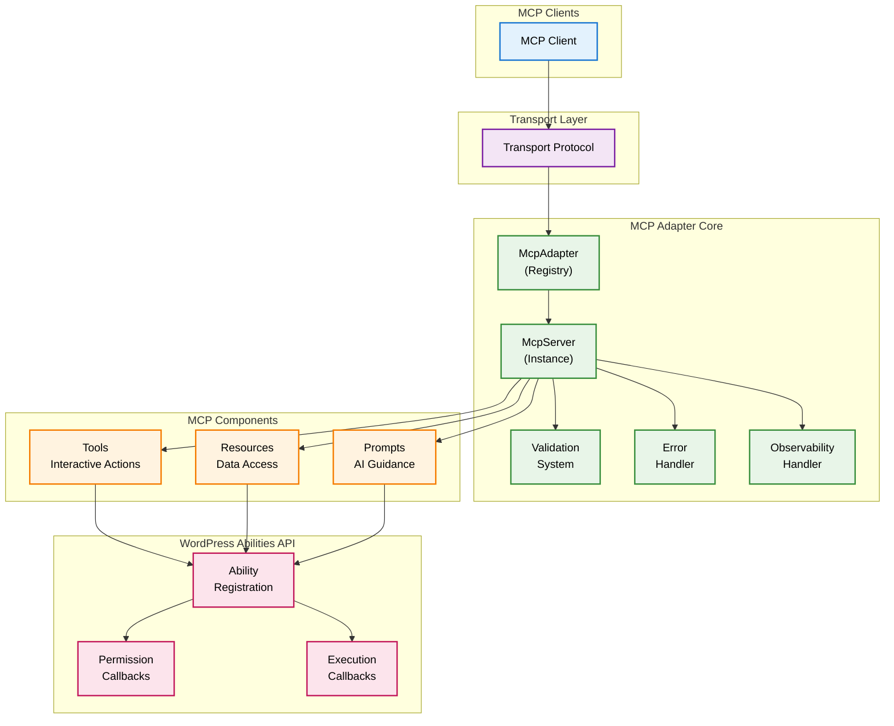
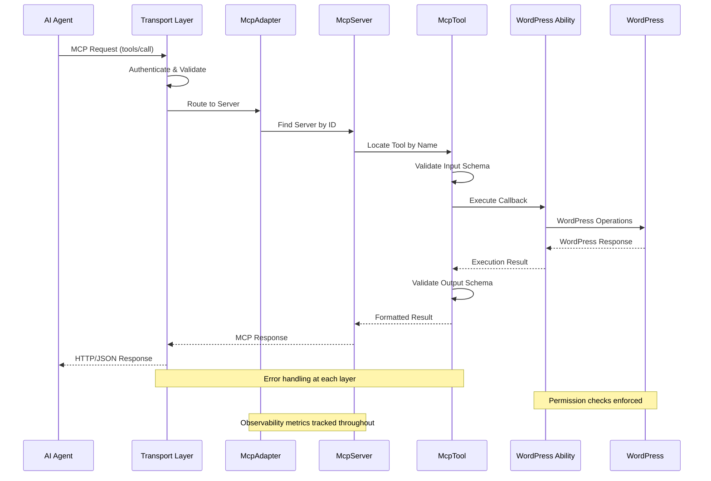
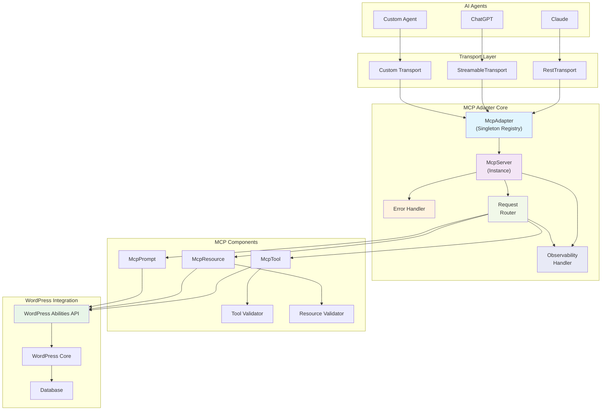
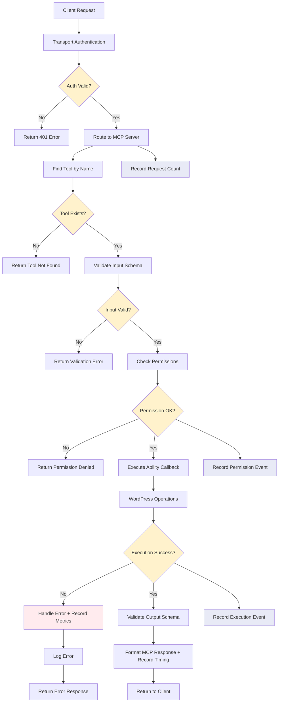

# Architecture Overview

This document provides a comprehensive overview of the MCP Adapter architecture, explaining how components interact and
the design decisions that enable flexible, scalable MCP integration with WordPress.

## Table of Contents

1. [System Architecture](#system-architecture)
2. [Component Relationships](#component-relationships)
3. [Data Flow](#data-flow)
4. [Design Patterns](#design-patterns)
5. [Extension Points](#extension-points)

## System Architecture

The MCP Adapter follows a layered architecture that cleanly separates concerns and provides multiple extension points
for customization.

### High-Level Architecture

The MCP Adapter follows a clean layered architecture with clear separation of concerns:

## Component Relationships



### Core Component Interaction

The following diagram shows how the main components interact within the MCP Adapter system:

### Request Flow Diagram

Here's how a typical MCP request flows through the system:



### Key Components Explained

#### McpAdapter (Singleton Registry)

- **Purpose**: Central registry managing multiple MCP servers
- **Responsibilities**:
    - Server lifecycle management (creation, configuration, retrieval)
    - WordPress integration hooks (`mcp_adapter_init`)
    - Global error handling coordination
    - REST API route registration orchestration

#### McpServer (Server Instance)

- **Purpose**: Individual MCP server with specific configuration
- **Responsibilities**:
    - Component registration (tools, resources, prompts)
    - Transport method configuration
    - Server-specific error handling
    - Validation coordination
    - Request routing to appropriate components

#### Transport Layer

- **Purpose**: Communication protocol implementation with dependency injection
- **Built-in Options**:
    - `RestTransport`: RESTful HTTP API implementation for mcp-wordpress-remote proxy
    - `StreamableTransport`: JSON-RPC 2.0 streaming implementation (requires OAuth2.1)
- **Architecture**: Interface-based with `McpTransportContext` for dependency injection
- **Customization**: Implement `McpTransportInterface` for custom protocols

#### Handler Architecture

The system uses specialized handlers for different MCP method categories:

- **InitializeHandler**: Handles server initialization and capability negotiation
- **ToolsHandler**: Manages tool listing and execution operations
- **ResourcesHandler**: Handles resource access, subscription, and listing
- **PromptsHandler**: Manages prompt listing and execution (including builder-based prompts)
- **SystemHandler**: Handles system operations (ping, logging, completion, roots)

Each handler is injected into transport implementations via `McpTransportContext` for loose coupling.

#### Request Routing

The `McpRequestRouter` service routes incoming MCP requests to appropriate handlers based on method names:

- `initialize/init` → InitializeHandler
- `tools/list`, `tools/call` → ToolsHandler
- `resources/list`, `resources/read`, `resources/subscribe` → ResourcesHandler
- `prompts/list`, `prompts/get` → PromptsHandler
- `ping`, `logging/setLevel`, `completion/complete`, `roots/list` → SystemHandler

The router also handles observability metrics and error propagation across all request types.

#### Observability System

The observability system provides comprehensive metrics tracking with zero-overhead when disabled:

- **McpObservabilityHandlerInterface**: Contract for metrics collection
- **ErrorLogMcpObservabilityHandler**: Default implementation logging to PHP error log
- **NullMcpObservabilityHandler**: Zero-overhead null object pattern
- **McpObservabilityHelperTrait**: Shared utilities for tag formatting, sanitization, and error categorization

**Tracked Metrics**:
- Request counts by method and transport
- Request timing and performance
- Error rates and categorization
- Tool execution success/failure rates
- Permission denials and authentication events

#### MCP Components

- **Tools**: Interactive, action-oriented functionality mapped from WordPress abilities
- **Resources**: Data access and information retrieval with subscription support
- **Prompts**: Structured guidance and recommendations with two execution paths:
    - **Ability-based**: Traditional WordPress ability execution
    - **Builder-based**: Direct execution through `McpPromptBuilder` implementations

## Data Flow



### Tool Execution Flow



### Resource Access Pattern

Resources follow a simpler pattern since they're primarily read-only:

```
Client Request → Authentication → Server Routing → Resource Lookup → 
Permission Check → Ability Execution → Data Formatting → Response
                ↓                     ↓                ↓              ↓
         Record Request         Record Access      Record Timing   Record Response
```

### Error Handling Flow

The system uses clean separation between error logging, error response creation, and observability:

```
Error Occurs → Exception Thrown → Caught by Transport → 
Error Response Created (McpErrorFactory) → Error Logged (McpErrorHandlerInterface) → 
                                       ↓                         ↓
                                Record Error Event        Record Error Metrics
                                (Observability)           (Categorization)
                                       ↓
Formatted Response → Returned to Client
```

#### Error Handling Components

- **McpErrorFactory**: Creates standardized JSON-RPC error responses
- **McpErrorHandlerInterface**: Interface for logging errors to monitoring systems  
- **ErrorLogMcpErrorHandler**: Default WordPress-compatible error logging
- **NullMcpErrorHandler**: Null object pattern for disabled error handling
- **Transport Level**: Catches exceptions and coordinates error handling
- **Handler Level**: Uses factory methods for consistent error responses
- **Ability Level**: WordPress abilities handle validation and execution errors

#### Error Response vs Error Logging

```php
use WP\MCP\Infrastructure\ErrorHandling\McpErrorFactory;

// Error response creation (for clients)
$error_response = McpErrorFactory::tool_not_found($request_id, $tool_name);

// Error logging (for monitoring)
if ($error_handler) {
    $error_handler->log('Tool not found', [
        'tool_name' => $tool_name,
        'user_id' => get_current_user_id(),
        'server_id' => $server_id
    ], 'error');
}
```

## Design Patterns

### Singleton Pattern (McpAdapter)

The `McpAdapter` class uses the singleton pattern to ensure a single point of coordination:

```php
use WP\MCP\Core\McpAdapter;

class McpAdapter {
    private static ?McpAdapter $instance = null;
    
    public static function instance(): McpAdapter {
        if ( self::$instance === null ) {
            self::$instance = new self();
        }
        return self::$instance;
    }
    
    private function __construct() {
        // Initialize adapter
    }
}
```

**Benefits**:

- Single source of truth for server management
- Prevents configuration conflicts
- Simplifies global state management

### Factory Pattern (Component Creation)

MCP components are created using factory methods with dependency injection:

```php
use WP\MCP\Core\McpServer;
use WP\MCP\Domain\Tools\RegisterAbilityAsMcpTool;
use WP\MCP\Domain\Resources\RegisterAbilityAsMcpResource;
use WP\MCP\Domain\Prompts\RegisterAbilityAsMcpPrompt;

class McpServer {
    public function add_tool( string $ability_name ): void {
        $tool = RegisterAbilityAsMcpTool::make( $ability_name, $this );
        $this->tools[ $tool->get_name() ] = $tool;
    }
    
    public function add_resource( string $ability_name ): void {
        $resource = RegisterAbilityAsMcpResource::make( $ability_name, $this );
        $this->resources[ $resource->get_name() ] = $resource;
    }
    
    public function add_prompt( string $ability_name ): void {
        $prompt = RegisterAbilityAsMcpPrompt::make( $ability_name, $this );
        $this->prompts[ $prompt->get_name() ] = $prompt;
    }
}
```

### Strategy Pattern (Transport Layer)

Different transport implementations use the strategy pattern:

```php
use WP\MCP\Transport\Contracts\McpTransportInterface;
use WP\MCP\Transport\Infrastructure\McpTransportContext;
use WP\MCP\Transport\Infrastructure\McpTransportHelperTrait;
use WP\MCP\Transport\Http\RestTransport;
use WP\MCP\Transport\Http\StreamableTransport;

interface McpTransportInterface {
    public function __construct( McpTransportContext $context );
    public function check_permission(): WP_Error|bool;
    public function handle_request( mixed $request ): mixed;
    public function register_routes(): void;
}

class RestTransport implements McpTransportInterface {
    use McpTransportHelperTrait;
    
    private McpTransportContext $context;
    
    public function __construct( McpTransportContext $context ) {
        $this->context = $context;
        add_action( 'rest_api_init', array( $this, 'register_routes' ), 20001 );
    }
    
    public function register_routes(): void {
        // REST-specific route registration with mcp-wordpress-remote compatibility
    }
    
    public function handle_request( mixed $request ): WP_REST_Response|WP_Error {
        // REST-specific request handling
    }
}

class StreamableTransport implements McpTransportInterface {
    use McpTransportHelperTrait;
    
    private McpTransportContext $context;
    
    public function __construct( McpTransportContext $context ) {
        $this->context = $context;
        add_action( 'rest_api_init', array( $this, 'register_routes' ), 20002 );
    }
    
    public function register_routes(): void {
        // JSON-RPC 2.0 streamable route registration
    }
    
    public function handle_request( mixed $request ): WP_REST_Response {
        // JSON-RPC 2.0 request handling
    }
}
```

### Builder Pattern (Prompt Creation)

The system supports two approaches for creating prompts:

```php
use WP\MCP\Domain\Prompts\McpPromptBuilder;
use WP\MCP\Domain\Prompts\Contracts\McpPromptBuilderInterface;

// 1. Builder-based prompts (bypass WordPress abilities)
abstract class McpPromptBuilder implements McpPromptBuilderInterface {
    protected string $name;
    protected ?string $title = null;
    protected ?string $description = null;
    protected array $arguments = array();
    
    abstract protected function configure(): void;
    abstract public function check_permission( array $arguments ): bool;
    abstract public function execute( array $arguments ): array;
    
    public function build(): McpPrompt {
        $this->configure();
        // Build prompt with direct execution capabilities
    }
}

// 2. Traditional ability-based prompts
class RegisterAbilityAsMcpPrompt {
    public static function make( string $ability_name, McpServer $server ): McpPrompt {
        // Convert WordPress ability to MCP prompt
    }
}
```

**Benefits of Builder Pattern**:
- Direct execution without WordPress ability overhead
- Custom permission checking logic
- Simplified testing and mocking
- Enhanced performance for complex prompts

### Adapter Pattern (WordPress Integration)

The core adapter pattern bridges WordPress abilities and MCP protocols:

```php
use WP\MCP\Domain\Tools\RegisterAbilityAsMcpTool;
use WP\MCP\Domain\Tools\McpTool;
use WP\MCP\Core\McpServer;

class RegisterAbilityAsMcpTool {
    private string $ability_name;
    private ?WP_Ability $ability;
    private McpServer $mcp_server;
    
    public static function make( string $ability_name, McpServer $mcp_server ): McpTool {
        $tool = new self( $ability_name, $mcp_server );
        return $tool->get_tool();
    }
    
    private function get_tool(): McpTool {
        // Convert WordPress ability to MCP tool
        return new McpTool( $this->ability, $this->mcp_server );
    }
}
```

## Extension Points

### Custom Transport Development

Create specialized communication protocols:

```php
use WP\MCP\Transport\Contracts\McpTransportInterface;
use WP\MCP\Transport\Infrastructure\McpTransportContext;
use WP\MCP\Transport\Infrastructure\McpTransportHelperTrait;

class MyCustomTransport implements McpTransportInterface {
    use McpTransportHelperTrait;
    
    private McpTransportContext $context;
    
    public function __construct( McpTransportContext $context ) {
        $this->context = $context;
        add_action( 'rest_api_init', array( $this, 'register_routes' ), 20003 );
    }
    
    public function check_permission(): WP_Error|bool {
        // Custom authentication logic
        return $this->authenticate_custom_request();
    }
    
    public function register_routes(): void {
        // Custom route registration
        register_rest_route(
            $this->context->mcp_server->get_server_route_namespace(),
            $this->context->mcp_server->get_server_route() . '/custom',
            array(
                'methods'             => WP_REST_Server::CREATABLE,
                'callback'            => array( $this, 'handle_request' ),
                'permission_callback' => array( $this, 'check_permission' ),
            )
        );
    }
    
    public function handle_request( mixed $request ): WP_REST_Response|WP_Error {
        // Custom request handling using context's request router
        return $this->context->request_router->route_request( 
            $request->get_param('method'), 
            $request->get_params(), 
            $request->get_param('id') ?? 0,
            'custom'
        );
    }
    
    private function authenticate_custom_request(): bool {
        // Custom authentication logic
        return true; // Implement your custom auth here
    }
}
```

### Error Handler Integration

Integrate with existing monitoring systems using the interface:

```php
use WP\MCP\Infrastructure\ErrorHandling\Contracts\McpErrorHandlerInterface;

class MyMonitoringErrorHandler implements McpErrorHandlerInterface {
    public function log(string $message, array $context = [], string $type = 'error'): void {
        // Send to your monitoring system
        MyMonitoringClient::send_error($message, $context, $type);
        
        // Fallback to file logging
        if (!$this->monitoring_available()) {
            error_log("[{$type}] {$message} | Context: " . wp_json_encode($context));
        }
    }
    
    private function monitoring_available(): bool {
        return class_exists('MyMonitoringClient') && MyMonitoringClient::is_connected();
    }
}
```

### Observability Handler Integration

Create custom observability handlers for metrics systems:

```php
use WP\MCP\Infrastructure\Observability\Contracts\McpObservabilityHandlerInterface;
use WP\MCP\Infrastructure\Observability\McpObservabilityHelperTrait;

class CustomMetricsObservabilityHandler implements McpObservabilityHandlerInterface {
    use McpObservabilityHelperTrait;
    
    public static function record_event( string $event, array $tags = array() ): void {
        $formatted_event = self::format_metric_name( $event );
        $merged_tags = self::merge_tags( $tags );
        
        // Send to your metrics system
        MyMetricsClient::counter( $formatted_event, 1, $merged_tags );
    }
    
    public static function record_timing( string $metric, float $duration_ms, array $tags = array() ): void {
        $formatted_metric = self::format_metric_name( $metric );
        $merged_tags = self::merge_tags( $tags );
        
        // Send timing to your metrics system
        MyMetricsClient::timing( $formatted_metric, $duration_ms, $merged_tags );
    }
}
```

### Custom Validation Rules

The adapter includes built-in validation through the WordPress Abilities API and individual validators:

```php
use WP\MCP\Domain\Tools\McpToolValidator;
use WP\MCP\Domain\Tools\McpTool;

// Validation is handled through the Abilities API schema validation
// and individual MCP component validators like McpToolValidator
class McpToolValidator {
    public function validate( McpTool $tool ): bool {
        // Tool-specific validation logic
        return $this->validate_tool_structure( $tool );
    }
}
```

This architecture enables both simple integrations and complex enterprise deployments while maintaining clean separation
of concerns and extensive customization capabilities.

## Next Steps

- **Review [Custom Transports](../guides/custom-transports.md)** for transport implementation details
- **Explore [Error Handling](../guides/error-handling.md)** for comprehensive error management
- **Check [Creating Abilities](../guides/creating-abilities.md)** for complete working implementations
- **See [API Reference](../api-reference/)** for detailed class documentation
